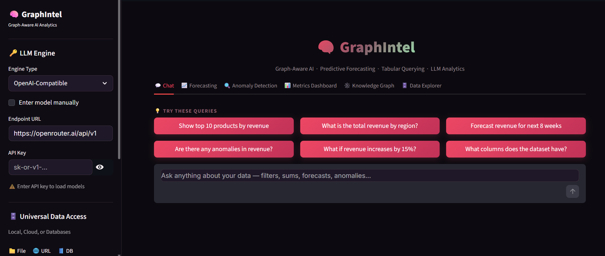
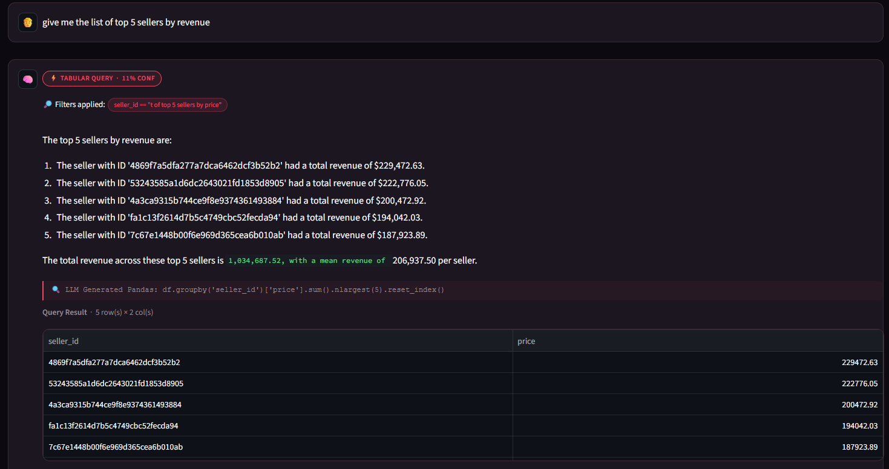
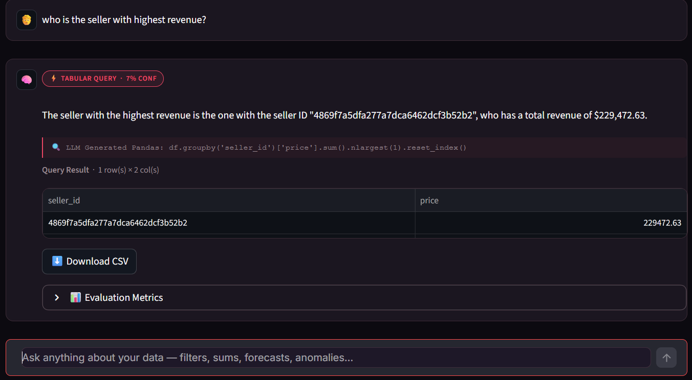
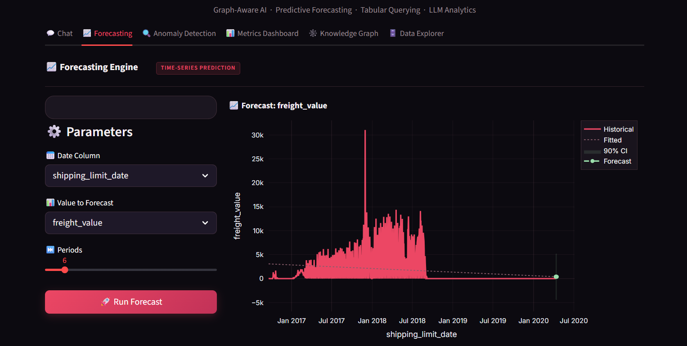
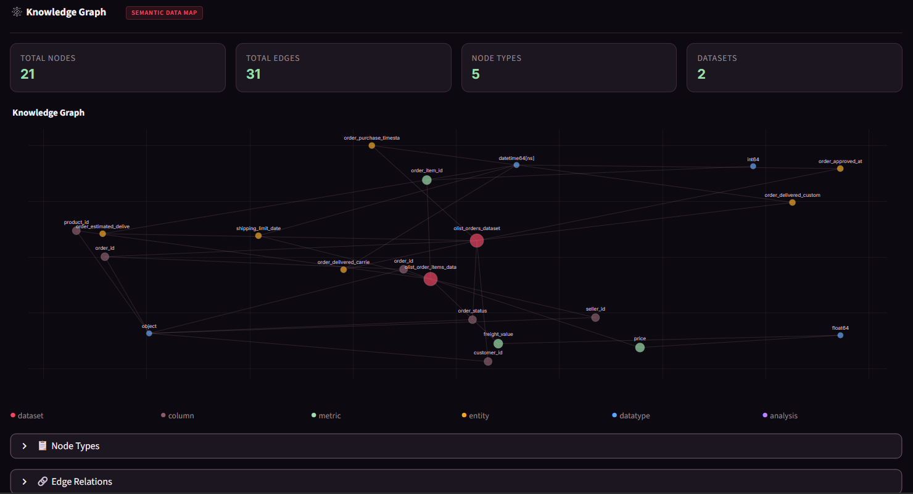
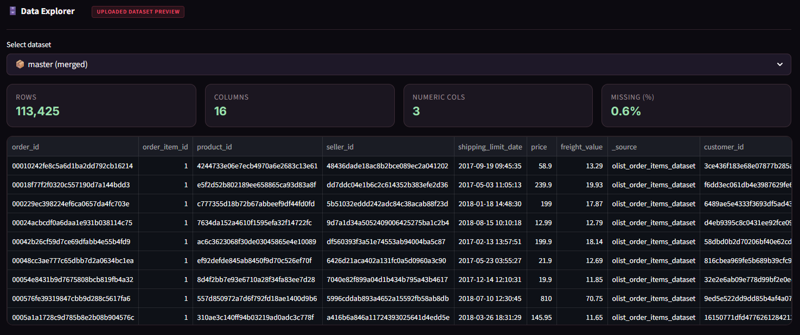
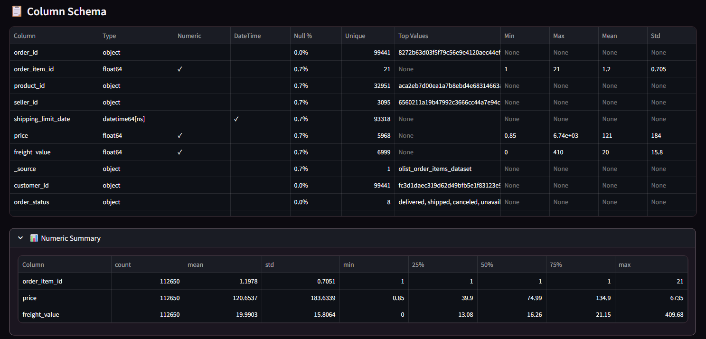

<div align="center">

#  GraphIntel
### Graph-Aware AI Analytics Chatbot

[](https://www.python.org/)
[](https://streamlit.io/)
[](LICENSE)
[](https://openrouter.ai/)
[](https://networkx.org/)

*Conversational, graph-grounded AI that turns raw CSV/JSON data into instant predictions,  
anomaly alerts, what-if scenarios, and natural-language insights.*



</div>

---

##  Table of Contents

- [Overview](#-overview)
- [Screenshots](#-screenshots)
- [Features](#-features)
- [Architecture](#-architecture)
- [Tech Stack](#-tech-stack)
- [Setup Instructions](#-setup-instructions)
- [Usage Examples](#-usage-examples)
- [Project Structure](#-project-structure)
- [Limitations & Future Improvements](#-limitations--future-improvements)

---

##  Overview

**GraphIntel** is a self-service business intelligence chatbot that combines a **Knowledge Graph** with an **LLM reasoning layer** to answer complex analytical questions about any uploaded dataset — with zero SQL or coding required from the user.

### The Problem It Solves

Traditional BI tools require SQL expertise or fixed dashboards. When a business analyst wants to ask *"Which seller has the highest revenue?"* or *"What happens if sales grow by 15% next quarter?"*, they either need a data engineer or a rigid chart that may not answer the right question.

**GraphIntel** bridges this gap by:
- Building a **semantic knowledge graph** of your data's structure and relationships automatically
- Routing natural language questions to the right analytical engine (query, forecast, anomaly, scenario)
- Using an **LLM to generate and execute precise Pandas code** directly on your full dataset
- Presenting results as interactive charts, tables, and human-readable explanations

### Target Users

| User | Use Case |
|------|----------|
|  Business Analysts | Query sales data, spot outliers, run scenarios |
|  E-commerce Teams | Identify top sellers, forecast revenue, detect fraud signals |
|  Data Scientists | Rapid EDA, automated anomaly detection, ML forecast baselines |
|  Non-technical Managers | Ask questions in plain English, get chart-backed answers |

---

##  Screenshots

<table>
  <tr>
    <td align="center"><b> Conversational AI Chat</b></td>
    <td align="center"><b> Single-result Query</b></td>
  </tr>
  <tr>
    <td></td>
    <td></td>
  </tr>
  <tr>
    <td align="center"><b> Forecasting Engine</b></td>
    <td align="center"><b> Knowledge Graph</b></td>
  </tr>
  <tr>
    <td></td>
    <td></td>
  </tr>
  <tr>
    <td align="center"><b> Data Explorer</b></td>
    <td align="center"><b> Column Schema</b></td>
  </tr>
  <tr>
    <td></td>
    <td></td>
  </tr>
</table>

---

##  Features

> **Only implemented and working features are listed below.**

###  1. Conversational AI Chat
- Natural language Q&A over any uploaded CSV or JSON file
- LLM-generated Pandas code executed directly on the full dataset for accurate, deterministic answers
- Fallback rule-based engine when no API key is provided
- **Suggested starter queries** on first launch for instant exploration


###  2. Time-Series Forecasting
- Polynomial ridge regression with automated date-column and value-column detection
- Configurable forecast horizon (1–52 periods), interactive parameter panel
- Displays: forecast line chart, confidence bands, residual chart, and tabular output
- Accuracy metrics: MAE, RMSE, MAPE, R², Directional Accuracy, Model vs Baseline comparison


###  3. Statistical Anomaly Detection
- Z-Score and IQR methods with a tunable threshold slider
- Multi-column simultaneous analysis
- Synthetic ground-truth validation (Precision, Recall, F1, False Positive Rate)
- Per-column statistics, z-score timeline, anomaly distribution chart

###  4. What-If / Scenario Analysis
- Interprets natural language hypotheticals ("What if revenue increases by 15%?")
- Applies assumptions to forecasting results and shows optimistic vs baseline delta

###  5. Knowledge Graph Engine
- Auto-builds a directed semantic graph (datasets → columns → datatypes → join keys)
- Graph-guided context retrieval improves column resolution for ambiguous queries
- Interactive Plotly force-directed visualisation with node-type colouring
- Persistent disk cache (content-hash-invalidated) for fast re-loads


###  6. Universal Data Access
- **File Upload**: CSV and JSON (multiple files, auto-merged on common keys)
- **Cloud/API URL**: Fetch remote CSVs or JSON directly by URL
- **Database**: Any SQLAlchemy connection string + raw SQL query

###  7. Metrics Dashboard
- Live quality tracking: schema grounding, numeric consistency, exact-match F1
- Forecast and anomaly metrics automatically populated as you use other tabs
- LLM narrative grounding rate (GAR)

###  8. Data Explorer
- Dataset preview (first 200 rows), column schema table, numeric summary statistics
- Join metadata display when multiple files are merged


---

##  Architecture

```
┌─────────────────────────────────────────────────────────────────────┐
│                         Streamlit UI (main.py)                      │
│  Chat · Forecasting · Anomaly · Metrics · Knowledge Graph · Explorer│
└───────────────┬──────────────────────────────┬──────────────────────┘
                │                              │
   ┌────────────▼───────────┐    ┌─────────────▼─────────────────┐
   │   Intent Router        │    │    Response Planner           │
   │   (NLP + regex rules)  │    │    (plan → render pipeline)   │
   └────────────┬───────────┘    └─────────────┬─────────────────┘
                │                              │
   ┌────────────▼──────────────────────────────▼───────────────────┐
   │                     Engine Layer                              │
   │                                                               │
   │  ┌──────────────┐  ┌───────────────┐  ┌──────────────────┐    │
   │  │ Tabular Query│  │  Forecasting  │  │ Anomaly Detection│    │
   │  │   Engine     │  │    Engine     │  │    Engine        │    │
   │  └──────────────┘  └───────────────┘  └──────────────────┘    │
   │                                                               │
   │  ┌──────────────┐  ┌───────────────┐  ┌──────────────────┐    │
   │  │  Scenario    │  │  LLM Engine   │  │  Result          │    │
   │  │  Engine      │  │ (OpenRouter)  │  │  Validator       │    │
   │  └──────────────┘  └───────────────┘  └──────────────────┘    │
   └─────────────────────────────────────┬─────────────────────────┘
                                         │
   ┌─────────────────┐    ┌──────────────▼──────────────────────┐
   │  Data Access    │    │   Knowledge Graph Engine            │
   │  Engine         │    │   (NetworkX · disk-cached)          │
   │  (File/URL/DB)  │    └─────────────────────────────────────┘
   └────────┬────────┘
            │
   ┌────────▼─────────────────────────────────────────┐
   │        Data Integration Engine                   │
   │  Preprocess → Schema → Merge → Master DataFrame  │
   └──────────────────────────────────────────────────┘
```

### Data Flow

1. **Ingest** — User uploads CSV/JSON/URL/DB → `DataAccessEngine` reads it
2. **Integrate** — `DataIntegrationEngine` normalises columns, imputes nulls, auto-merges multiple files, builds schema metadata
3. **Graph** — `KnowledgeGraphEngine` builds a directed graph of datasets, columns, types, and join keys; persists cache
4. **Route** — `IntentRouter` classifies the natural-language query into one of: `tabular_query`, `forecast`, `anomaly`, `scenario`, `schema_query`, `general_qa`
5. **Execute** — The appropriate engine runs on the **full master DataFrame**; LLM generates precise Pandas code for tabular/general intents
6. **Validate** — `ResultValidationEngine` scores accuracy, grounding, and coherence
7. **Render** — `ResponsePlanner` packages results; UI renders charts, tables, and LLM narrative

---

## 🛠️ Tech Stack

| Layer | Technology | Why Chosen |
|-------|-----------|------------|
| **UI / App Framework** | [Streamlit](https://streamlit.io/) ≥ 1.32 | Rapid, Python-native interactive dashboards |
| **Data Manipulation** | [Pandas](https://pandas.pydata.org/) ≥ 2.0 | Industry-standard DataFrame operations |
| **Numerical Computing** | [NumPy](https://numpy.org/) ≥ 1.24 | Fast array arithmetic for forecasting & anomaly maths |
| **Knowledge Graph** | [NetworkX](https://networkx.org/) ≥ 3.0 | Lightweight, pure-Python directed graph library |
| **Visualisation** | [Plotly](https://plotly.com/) ≥ 5.18 | Interactive, web-native charts inside Streamlit |
| **Machine Learning** | [scikit-learn](https://scikit-learn.org/) ≥ 1.3 | Ridge regression, polynomial features, scalers, metrics |
| **Statistical Analysis** | [SciPy](https://scipy.org/) ≥ 1.11 | Z-score computation, IQR anomaly detection |
| **LLM Integration** | [OpenAI SDK](https://github.com/openai/openai-python) ≥ 1.0 + [OpenRouter](https://openrouter.ai/) | OpenAI-compatible client works with 200+ models; free tier available |
| **HTTP Client** | [Requests](https://requests.readthedocs.io/) ≥ 2.31 | Model listing from OpenRouter REST API |
| **Columnar Storage** | [PyArrow](https://arrow.apache.org/) ≥ 14.0 | Parquet/Arrow support, faster Pandas I/O |
| **Language** | Python 3.10+ | Type hints, dataclasses, match-case support |

### AI Tools Used

| Tool | Role |
|------|------|
| **OpenRouter API** | Routes requests to any LLM (Gemini, GPT-4o, Claude, Llama, etc.) |
| **LLM (user-selected)** | Generates Pandas code, explains results in plain English, answers schema queries |
| **Knowledge Graph** | Provides semantic context to improve column resolution and intent accuracy |

---

##  Setup Instructions

### Prerequisites

- Python **3.10 or higher**
- `pip` (comes with Python)
- An [OpenRouter](https://openrouter.ai/) API key *(free tier available — optional for basic use)*

---

### Step 1 — Clone the Repository

```bash
git clone https://github.com/ranjanaashish/Natwest-Code-for-Purpose.git
cd Natwest-Code-for-Purpose
```

### Step 2 — Create a Virtual Environment

```bash
# Windows
python -m venv .venv
.venv\Scripts\activate

# macOS / Linux
python -m venv .venv
source .venv/bin/activate
```

### Step 3 — Install Dependencies

```bash
pip install -r requirements.txt
```

### Step 4 — Configure Environment Variables

```bash
# Copy the template
cp .env.example .env

# Open .env and fill in your OpenRouter API key:
# OPENROUTER_API_KEY=sk-or-v1-xxxxxxxxxxxxxxxx
```

> **Note:** The `.env` file is only a convenience reference. GraphIntel reads the API key directly from the sidebar UI at runtime — you do **not** need to set environment variables for the app to start.

### Step 5 — Run the Application

```bash
streamlit run main.py
```

The app will open automatically at `http://localhost:8501`.

---

### Quick Start


1. Launch the app (`streamlit run main.py`)
2. Click **" Load Sample Data"** in the sidebar to load the built-in demo dataset
3. Click any suggestion card (e.g. *"Show top 10 products by revenue"*)
4. Switch tabs to explore **Forecasting**, **Anomaly Detection**, and the **Knowledge Graph**

To unlock **LLM-powered explanations**, enter your OpenRouter API key in the sidebar and select any free model (marked 🆓).

---

##  Usage Examples

### Natural Language Queries

```
"Show top 10 sellers by total revenue"
"What is the average order value by region?"
"Are there any anomalies in the price column?"
"Forecast monthly revenue for the next 12 weeks"
"What if sales increase by 20%?"
"What columns does the dataset have?"
```


### Database Tab (SQLAlchemy)

```
Connection String:  sqlite:///sales.sqlite
Query:              SELECT * FROM orders WHERE year = 2024
```

### Cloud/URL Tab

```
URL:  https://raw.githubusercontent.com/.../sales_data.csv
```

---

##  Project Structure

```
mtp_chatbot3/
│
├── main.py                   # Streamlit entry point — UI, routing, session state
│
├── engines/                  # Modular analytical engine layer
│   ├── __init__.py
│   ├── data_access.py        # File upload, URL fetch, database connection
│   ├── data_integration.py   # Preprocessing, schema inference, dataset merging
│   ├── knowledge_graph.py    # NetworkX KG: build, cache, retrieve context
│   ├── intent_router.py      # NLP-based intent classification + filter extraction
│   ├── tabular_query.py      # Rule-based group-by, filter, aggregate execution
│   ├── forecasting.py        # Ridge regression time-series forecasting
│   ├── anomaly_detection.py  # Z-Score & IQR anomaly detection + GT validation
│   ├── scenario_analysis.py  # What-if scenario modelling on forecast output
│   ├── llm_explanation.py    # OpenRouter LLM calls, Pandas code generation
│   ├── result_validation.py  # Quantitative output quality metrics
│   └── response_planner.py   # ResponsePlan dataclass + planner helpers
│
├── ui/                       # UI component library
│   ├── __init__.py
│   ├── components.py         # Plotly charts, metric cards, table renderers
│   └── styles.css            # Custom dark-mode CSS theme
│
├── docs/
│   └── screenshots/          # App screenshots used in README
│
├── requirements.txt          # Python dependencies with version pins
├── .env.example              # Environment variable template (no real secrets)
├── .gitignore                # Files excluded from version control
└── README.md                 # This file
```

---

##  Limitations & Future Improvements

### Current Limitations

| Area | Limitation |
|------|-----------|
| **Forecasting** | Uses linear Ridge regression; no seasonality decomposition (no Prophet/ARIMA) |
| **Anomaly Detection** | Z-Score and IQR are univariate; no multivariate or ML-based detection (Isolation Forest, etc.) |
| **LLM Code Execution** | Pandas code runs in a restricted `eval()` scope — complex multi-step operations may fail |
| **Data Size** | Designed for datasets up to ~500K rows; very large files may hit Streamlit memory limits |
| **Authentication** | No user login or multi-tenant data isolation |
| **Database** | Read-only SQL queries; write-back not supported |

### Planned Improvements

- [ ] **Advanced Forecasting** - integrate seasonal decomposition (STL) and Prophet
- [ ] **ML Anomaly Detection** - Isolation Forest, One-Class SVM, LSTM autoencoders
- [ ] **Multi-turn Conversation Memory** - context-aware follow-up questions
- [ ] **Export & Reporting** - PDF/Excel report generation from chat results
- [ ] **User Authentication** - Streamlit-Authenticator or OAuth integration
- [ ] **Streaming LLM Responses** - token-by-token render for better UX
- [ ] **Vector Store for KG** - embed column descriptions for semantic similarity search
- [ ] **Advanced Dataset Integration** - use of Relational Algebra

---

##  License

This project is licensed under the **Apache License 2.0** - see the [LICENSE](LICENSE) file for details.

---

<div align="center">

**GraphIntel** · Graph-Aware Intelligence

</div>
